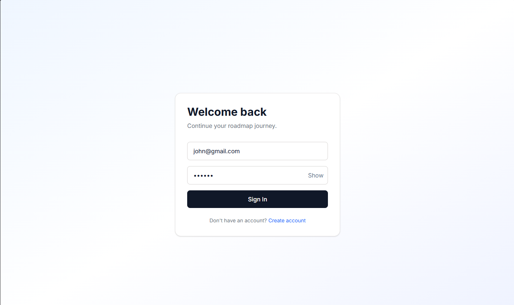
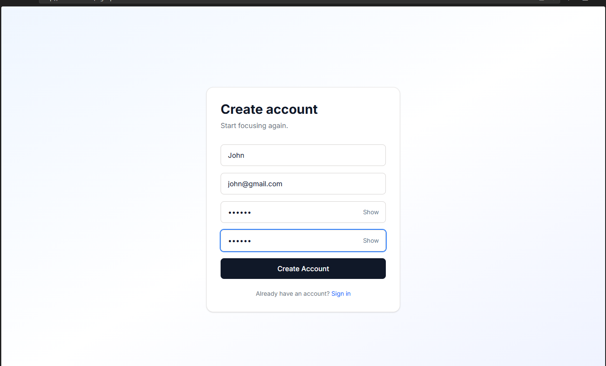
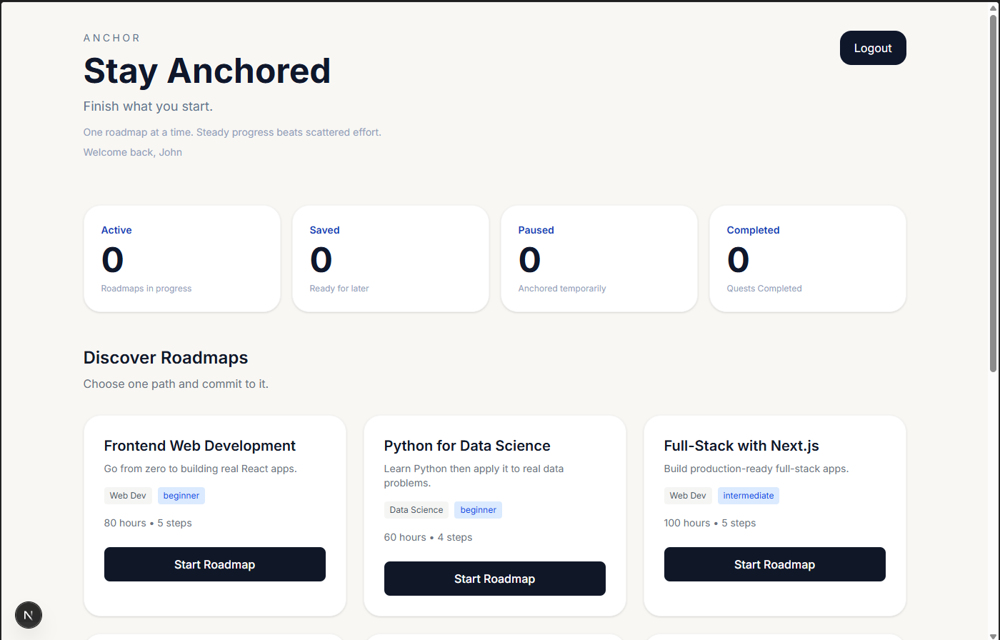
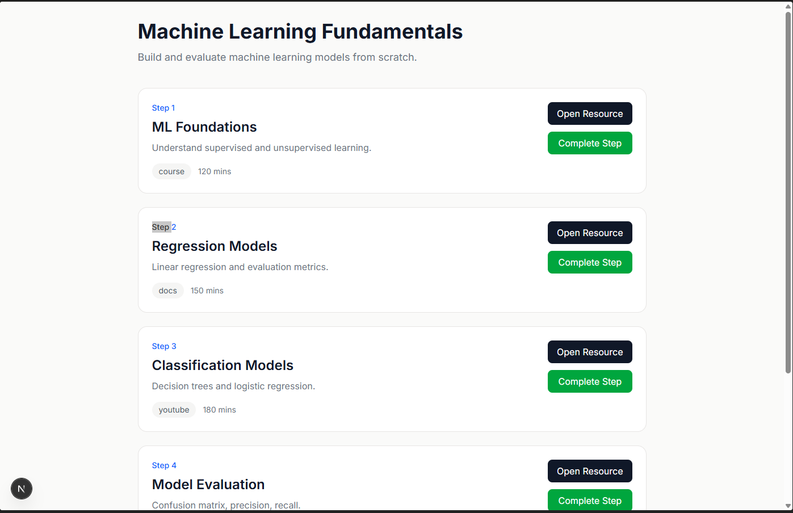
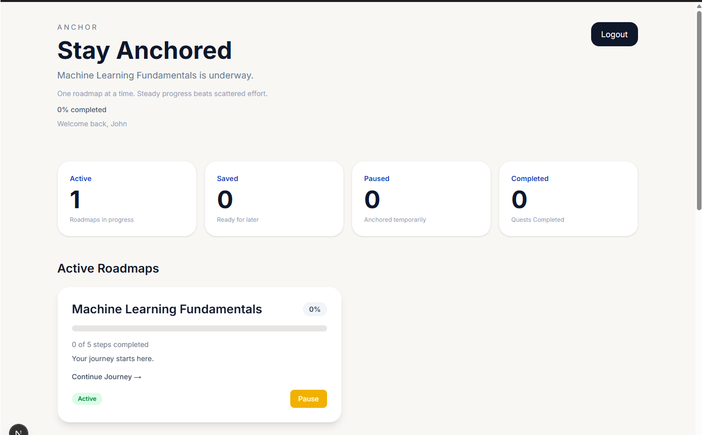
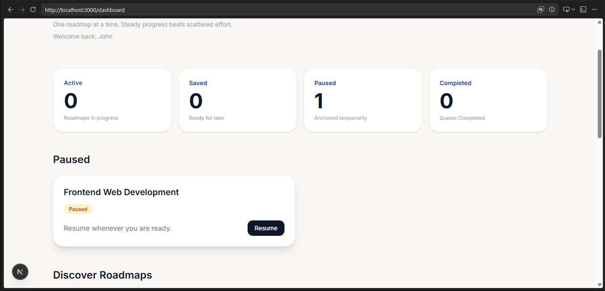
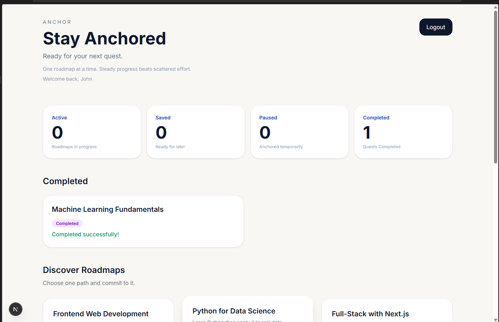

# Anchor

> One roadmap at a time.

Anchor is a full-stack learning roadmap tracker designed to help learners stay focused on a single goal. Instead of collecting endless courses and tutorials, users can follow structured learning paths, track their progress, and complete one roadmap before moving on to the next.

---

## Features

### Authentication

* User Registration & Login
* JWT-based Authentication
* Protected Routes
* Password Visibility Toggle
* Confirm Password Validation

### Roadmap Management

* Browse Curated Learning Paths
* Start a Roadmap
* Save Roadmaps for Later
* Pause & Resume Learning
* Complete Learning Paths
* Prevent Duplicate Roadmap Enrollment

### Progress Tracking

* Step-by-Step Progress Monitoring
* Completion Tracking
* Automatic Progress Calculation
* Active, Saved, Paused, and Completed Roadmap Views

### Learning Resources

* Curated Learning Materials
* Resource Links for Every Step
* Estimated Learning Durations

---

## Tech Stack

### Frontend

* Next.js
* TypeScript
* Tailwind CSS
* Axios

### Backend

* FastAPI
* SQLAlchemy
* Pydantic
* JWT Authentication

### Database

* SQLite

---

## Learning Paths Included

* Frontend Development
* Backend Development
* Python Programming
* Data Analytics
* Data Science Fundamentals
* Machine Learning
* SQL for Data Analysis

---

## Screenshots

### Login Page



### Signup Page



### Dashboard



### Roadmap Details



### Active Roadmaps



### Paused Roadmaps



### Completed Roadmaps



---

## Local Setup

### Clone Repository

```bash
git clone <repository-url>
cd anchor
```

### Backend Setup

```bash
cd backend

python -m venv venv

# Windows
venv\Scripts\activate

pip install -r requirements.txt

python seed.py

uvicorn app.main:app --reload --port 8000
```

### Frontend Setup

```bash
cd frontend

npm install

npm run dev
```

### Environment Variables

Create a `.env.local` file inside the frontend directory:

```env
NEXT_PUBLIC_API_URL= your_public_url
```

---

## Motivation

Learning often fails not because of a lack of resources, but because of a lack of focus.

Anchor encourages learners to commit to a single roadmap, make consistent progress, and complete what they start.

---

## Future Improvements

* Learning Streak System
* User-Created Roadmaps
* Search & Filtering
* Personalized Recommendations
* Progress Analytics
* Reminder Notifications

---

## Author

**Shreya Jadhav**

Built using Next.js, FastAPI, SQLAlchemy, SQLite, and TypeScript.
